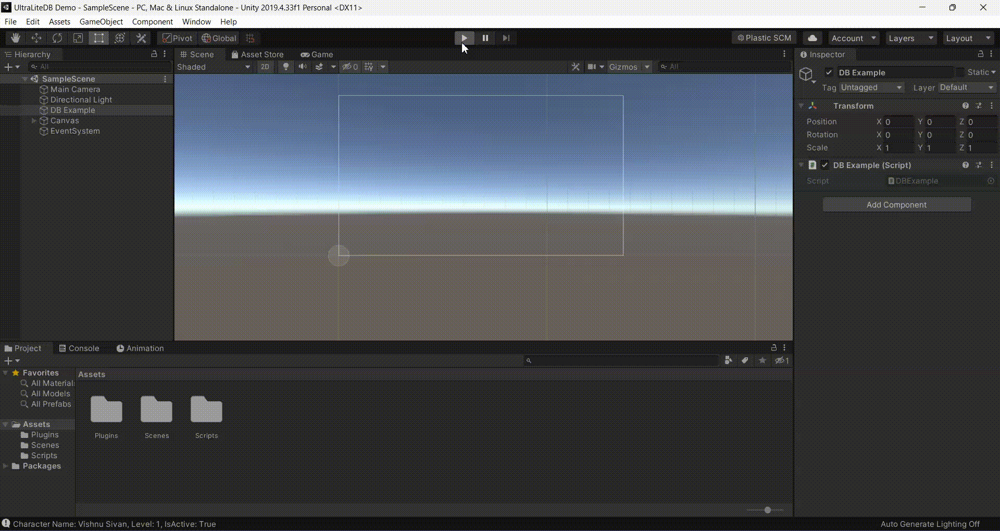

# UltraLiteDB - A bare-bones C# .NET Key-value Store in a single database file, intended for use in Unity

UltraLiteDB is a trimmed down version of LiteDB 4.0 (http://www.litedb.org). Anything that needs Linq or dynamic code generation has been removed to make it work in Unity's IL2CPP AoT runtime environment. Some additional features have been removed to reduce code footprint. What's left is a very small, fast key-value store that lets you save and load BSON-encoded data in any Unity environment.



## Major features missing from LiteDB

- Due to linq limitations, there are no expressions. Queries and indexes are limited to simple top level fields only.
- Thread and file locking overhead has been removed, databases must be accessed from a single thread, which should not be an issue in Unity.
- File storage and streaming have been removed as not needed in a Unity setting.
- No cross-collection document referencing
- No interactive shell

## So what's still there?

- The POCO to BSON mapper allows you to BSON-encode most any C# object or struct with little work.
- A very fast way to save, load and update BSON-encoded data into a compact, encrypted, managable single file.
- Basic queries on the primary key and user-created indexes (all, less than, greater than, between, in, etc)
- Simple API similar to MongoDB
- File format compatibility with LiteDB
- 100% C# code for .NETStandard 2.0 Unity preset in a single DLL (~172 kb)
- ACID in document/operation level
- Data recovery after write failure (journal mode)
- Datafile encryption using DES (AES) cryptography
- Open source and free for everyone - including commercial use
- What, you need more than that?

## Documentation

For basic CRUD operations, the [LiteDB documentation](https://github.com/mbdavid/LiteDB/wiki) largely applies to UltraLiteDB.

The biggest difference is that any query or index method using a linq expression method are missing.

## How to use UltraLiteDB

A quick example for storing and searching documents:

```C#
using UltraLiteDB;

void DatabaseTest()
{
    // Open database (or create if doesn't exist)
    var db = new UltraLiteDatabase("MyData.db");

    // Get a collection
    var collection = db.GetCollection("savegames");

    // Create a new character document
    var character = new BsonDocument();
    character["Name"] = "Codemaker2015";
    character["Level"] = 1;
    character["IsActive"] = true;

    // Insert new customer document (Id will be auto generated)
    BsonValue id = collection.Insert(character);
    // new Id has also been added to the document at character["_id"]

    // Update a document inside a collection
    character["Name"] = "Vishnu Sivan";
    collection.Update(character);

    // Insert a document with a manually chosen Id
    var character2 = new BsonDocument();
    character2["_id"] = 17;
    character2["Name"] = "Test Bob";
    character2["Level"] = 10;
    character2["IsActive"] = true;
    collection.Insert(character2);

    // Load all documents
    List<BsonDocument> allCharacters = new List<BsonDocument>(collection.FindAll());

    foreach (var row in allCharacters)
    {
        // Accessing fields using key names
        string name = row["name"];
        int level = row["level"];
        bool isActive = row["IsActive"];

        // Print out the character details
        string data = $"Character Name: {name}, Level: {level}, IsActive: {isActive}\n";
        info.text += data;
        Debug.Log(data);
    }

    // Delete something
    collection.Delete(10);

    // Upsert (Update if present or insert if not)
    collection.Upsert(character);

    // Don't forget to cleanup!
    db.Dispose();
}
```